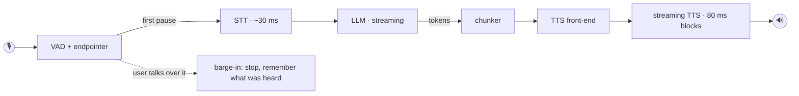

<div align="center">

# Sokhan · سخن

**A realtime, omni-style voice assistant built from specialist models.**
VAD → STT → LLM → TTS, fused into one engine that listens, thinks and speaks like a single model.
It runs 4-bit on a plain CPU, fully offline once downloaded.


</div>

```python
from sokhan import Omni

omni = Omni()          # every stage has a tuned default and downloads on first run
omni.start()
omni.listen()          # microphone in, speakers out: just talk
omni.run_forever()
```

---

## Why specialists instead of one omni model

A single speech-to-speech model has to be huge to be good at everything at once. Sokhan pairs
small, sharp specialists and makes the seams disappear:

| Stage | Default | Size (4-bit) |
|---|---|---|
| **VAD** | Silero VAD | 2 MB |
| **STT** | Shenava-Rizeh, FastConformer CTC via sherpa-onnx | 38 MB |
| **LLM** | Qwen3.5-4B Q4_K_M via llama.cpp | ~2.7 GB |
| **TTS** | Pocket-TTS Farsi v2, pure ONNX, streaming, **voice cloning** | ~180 MB |

The result is lighter and cheaper to run than a monolithic omni model, and each part is the best
at its own job. Every stage is swappable from the config.

## What makes it feel like one model



- **Speculative turns.** At the first ~240 ms pause the engine transcribes the utterance and
  starts replying *while it is still deciding whether you are done*. The audio is held back.
  When the turn is confirmed the first words play at once. If you keep talking, the speculation
  is discarded without a trace.
- **Adaptive end of turn.** "…and" waits for more; "…please." does not. The silence needed
  depends on the words (and the intonation).
- **Streaming everywhere.** Tokens become speakable chunks, chunks become 80 ms audio blocks
  while they are generated, and the text front-end of the next sentence runs in parallel.
- **The LLM never re-reads the conversation.** History is kept token-exact and append-only, so
  a turn only pre-fills the new message. Rollbacks restore saved state checkpoints, which also
  covers hybrid models such as Qwen3.5 whose state cannot be truncated.
- **Barge-in.** Talk over it and it stops within a few frames. The next turn tells the model
  exactly what you heard of its unfinished answer.
- **Prosody hints.** Pitch, energy, pace and intonation reach the LLM as a tiny `[voice: …]` note.

### Measured

On a 4-core laptop CPU (no GPU) with the local Qwen3.5-2B test model:

| | old pipeline | **Sokhan 1.0** |
|---|---:|---:|
| TTS time to first audio block | 3–6 s (whole chunk first) | **~0.08 s** |
| STT per utterance | ~20–50 ms | **~30–50 ms** |
| LLM first token, history cached | full re-read after any edit | **~0.4 s** |
| Startup, models cached | > 10 s (voice re-encoded every start) | **~5 s** |
| End of speech → first spoken word | ≈ 4–8 s (estimated from the stages) | **~1.4 s** (en) · **~1.8 s** (fa) |

A modern desktop CPU or any GPU brings the last row well under a second.

## Install

```bash
git clone https://github.com/mr-r0ot/Sokhan-Omini-Light && cd Sokhan-Omini-Light
python -m venv .venv && .venv\Scripts\activate        # macOS/Linux: source .venv/bin/activate
pip install -r requirements.txt
```

Models download automatically on first use to `~/.cache/sokhan` (set `SOKHAN_HOME` to move
them). The optional `onnx` package quantizes the speech models to 4-bit once, locally.

<details>
<summary><b>GPU</b></summary>

```bash
# NVIDIA
CMAKE_ARGS="-DGGML_CUDA=on" pip install llama-cpp-python --force-reinstall --no-cache-dir
pip install onnxruntime-gpu
# Apple Silicon
CMAKE_ARGS="-DGGML_METAL=on" pip install llama-cpp-python --force-reinstall --no-cache-dir
```

Then set `config.hardware.use_gpu = True`. It is detected automatically and falls back to CPU.
</details>

## Examples

| | |
|---|---|
| [`examples/01_simple_chat.py`](examples/01_simple_chat.py) | The smallest voice conversation: ~15 lines, webcam lines included (commented out). |
| [`examples/02_desktop_assistant.py`](examples/02_desktop_assistant.py) | A polished desktop assistant: animated orb, streaming chat bubbles (RTL aware), 5-second voice cloning, camera, latency readout. |
| [`examples/03_colab_demo.ipynb`](examples/03_colab_demo.ipynb) | Talk to it from Google Colab in the browser (mic, speaker, webcam, barge-in). |

Or straight from the terminal:

```bash
python -m sokhan                 # voice
python -m sokhan chat            # text
python -m sokhan report          # hardware, plan, model sizes
python -m sokhan --language en --llm-model path/to/model.gguf
```

## Use it as a library

```python
from sokhan import Config, Omni, tool

@tool
def add_item(name: str, qty: int = 1) -> str:
    """Add a dish to the order.

    name: the dish, e.g. "pizza"
    """
    return f"{qty} x {name} added"

omni = Omni(Config(), tools=[add_item])
omni.on("transcript",     lambda text: print("you:", text))
omni.on("response_delta", lambda text: print(text, end=""))
omni.start()

omni.ask("two pizzas please")      # blocking text chat -> reply string
omni.send_text("hello")            # as if spoken; the answer is spoken too
omni.say("Your order is ready.")   # speak verbatim
omni.interrupt()                   # stop talking now
```

The engine is transport-agnostic. Push audio from anywhere (a SIP call, a WebSocket, a file) and
take audio out however you like:

```python
omni.feed_audio(pcm, sr=48000)                       # any rate, int16 or float32
omni.on("audio", lambda audio, sr: send(audio, sr))  # 24 kHz float32 blocks
omni.on("audio_flush", stop_playback)                # the user interrupted
```

### Events

| event | arguments |
|---|---|
| `ready` · `load_progress` | – · `stage, fraction, message` |
| `state` | `state`: idle · listening · thinking · speaking |
| `speech_start` · `speech_end` | – · `duration_ms` |
| `partial_transcript` · `transcript` | `text` |
| `response_start` · `response_delta` · `response_done` | `turn_id` · `text` · `text, interrupted` |
| `tool_call` | `name, arguments, result` |
| `audio` · `audio_flush` | `audio, sr` · – |
| `interrupted` | `reason, heard` |
| `metrics` | `latency_ms, stt_ms, llm_ttft_ms, tts_first_ms, …` |
| `level` · `prosody` · `warning` · `error` | … |

Handlers receive only the arguments they ask for, and `omni.on("*", fn)` receives everything.

## Configuration

Everything is a plain dataclass with a tuned default. Change only what you need:

```python
cfg = Config()

# the brain: any GGUF repo on Hugging Face, or a local file
cfg.llm.model = "unsloth/Qwen3.5-9B-GGUF"
cfg.llm.quant = "Q4_K_M"                   # 4-bit default; "Q8_0", "BF16", ...
cfg.llm.temperature, cfg.llm.top_p, cfg.llm.top_k, cfg.llm.min_p = 0.7, 0.8, 20, 0.0
cfg.llm.repeat_penalty, cfg.llm.presence_penalty, cfg.llm.max_tokens = 1.0, 0.0, 220

# ears
cfg.stt.model = "csukuangfj/sherpa-onnx-whisper-small"
cfg.stt.model_type = "whisper"             # nemo_ctc | whisper | transducer | paraformer | sense_voice

# voice
cfg.tts.voice = "me.wav"                   # ~5 s sample -> cloned (when the model can)
cfg.tts.temperature, cfg.tts.speed = 0.3, 1.0

# turn-taking
cfg.turn.end_silence_ms = 500              # how long a finished-sounding pause must be
cfg.turn.barge_in = True

cfg.hardware.use_gpu = True
cfg.save("assistant.json")                 # Config.load("assistant.json")
```

**Presets:** `Config.preset("fast" | "lowmem" | "quality")`.
**Languages:** `Config.for_language("en")` picks multilingual Whisper STT and a Piper voice for
the language (the Qwen3.5 LLM is multilingual already). Persian keeps its specialist defaults.
Language-specific logic (numbers → words, end-of-turn cues) lives in small packs in
[`sokhan/lang.py`](sokhan/lang.py), so adding a language takes a few lines.

### Swap any model

```python
cfg.llm.backend = "openai"                      # Ollama, vLLM, LM Studio, any cloud API
cfg.llm.base_url = "http://localhost:11434/v1"
cfg.llm.model_name = "qwen3.5:9b"

cfg.tts.backend = "sherpa_onnx"                 # any Piper / VITS / Kokoro / Matcha voice
cfg.tts.model = "csukuangfj/vits-piper-de_DE-thorsten-medium"

cfg.stt.backend = "my_package.asr:MyASR"        # your own class, by import path
```

Or register your own backend (`@sokhan.register("tts", "my_tts")`), or pass instances directly:
`Omni(cfg, stt=..., llm=..., tts=..., vad=...)`. Each interface is a single method to implement.

### Voice cloning

```python
if omni.capabilities["voice_cloning"]:          # checked against the loaded model, never assumed
    omni.clone_voice("me.wav")                  # or: omni.clone_voice(samples, sr=24000)
```

A clean 3–5 s sample is enough. The cloned voice is cached, so switching back is instant.

### Vision

```python
cfg.vision.enabled = True                       # Qwen3.5 + its mmproj file (downloaded automatically)
from sokhan.vision import Webcam
Webcam(omni).start()                            # every question carries a fresh frame
```

## Project layout

```
sokhan/
  engine.py     the realtime orchestrator: turns, speculation, barge-in, streaming
  vad.py        Silero/energy VAD, endpointer state machine, echo-aware barge-in
  stt.py        sherpa-onnx recognizers (CTC, Whisper, Transducer, ...)
  llm.py        llama.cpp (token-exact cache + checkpoints), OpenAI-compatible, llama-server
  tts.py        streaming Pocket-TTS with cloning, sherpa-onnx voices
  text.py       stream filter (JSON + XML tool calls), chunker, TTS cleanup
  lang.py       language packs
  config.py     every knob, presets, for_language()
  models.py     resumable downloads, GGUF selection, one-time 4-bit quantization
  colab.py      browser bridge for notebooks
examples/       three ready-to-run examples
tests/          engine behaviour with mock models (no downloads)
```

Run the tests with `pytest`.

## Notes

- **Tool calling** works with any backend through the model's own chat template. Small models
  (2B) sometimes answer without calling the tool; 4B and up are far more reliable.
- **License of the default voice:** Pocket-TTS Farsi v2 is **CC-BY-NC-4.0** (non-commercial).
  For commercial use, pick another TTS backend or license the model.
- **Echo:** barge-in learns the speaker-to-mic echo path. On loud open speakers without echo
  cancellation, headphones or `cfg.turn.half_duplex = True` give the cleanest results. (The
  browser in Colab cancels echo on its own.)

### for example you can use KittenTTS for english TTS engine
https://github.com/KittenML/KittenTTS

### the defult TTS persian engine don't perfect 

### if going something worng with models just change to a better option

<div align="center"><sub>MIT licensed · built for people who want an assistant that simply talks.</sub></div>
